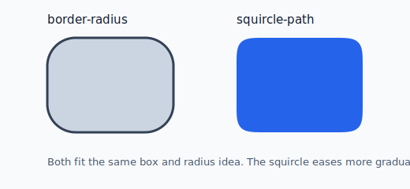
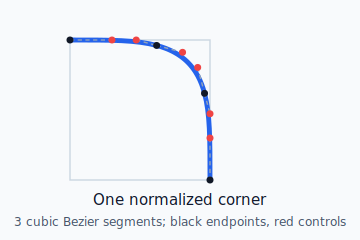
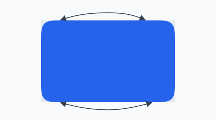
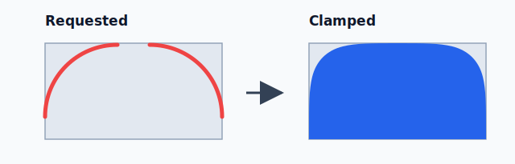

# squircle-path

Tiny TypeScript utility for generating smooth squircle SVG paths for SVG,
CSS `clip-path`, and Canvas.

It uses the 3-cubic-Bezier-per-corner approximation described by
[OrgPad's squircle article](https://orgpad.info/blog/squircles), then mirrors
that normalized corner around a rectangle.



Both shapes fit the same box and use the same radius idea. The squircle eases
more gradually into the corner.

## Why

CSS `border-radius` uses circular arcs. Those arcs meet straight edges abruptly,
which can make large rounded corners feel mechanical.

Squircles ease more gradually from the straight edge into the corner. That is
the softer Apple-like shape used in many modern interfaces.

## Install

```sh
pnpm add squircle-path
```

```sh
npm install squircle-path
```

## Local Example Preview

When previewing the example HTML files from this repository, build the package
first so the examples can import the local `dist` output:

```sh
pnpm build
python3 -m http.server 4173
```

Then open:

- `http://localhost:4173/examples/svg-basic.html`
- `http://localhost:4173/examples/css-clip-path.html`
- `http://localhost:4173/examples/canvas-path2d.html`

## Quick Start

```ts
import { getSquirclePath } from "squircle-path";

const path = getSquirclePath({
  width: 240,
  height: 120,
  radius: 32,
});
```

Use the returned string anywhere an SVG path `d` value is accepted.

```html
<svg viewBox="0 0 240 120">
  <path d="..." fill="black" />
</svg>
```

## API

### `getSquirclePath(options)`

Generates a path in the same coordinate space as the provided `width` and
`height`.

```ts
getSquirclePath({
  width: 240,
  height: 120,
  radius: 32,
});
```

`radius` can be a number or per-corner radii:

```ts
getSquirclePath({
  width: 240,
  height: 120,
  radius: {
    topLeft: 12,
    topRight: 32,
    bottomRight: 48,
    bottomLeft: 20,
  },
});
```

### `getSquircleUnitPath(options)`

Generates a normalized path in `0..1` space. This is useful for SVG
`clipPathUnits="objectBoundingBox"`.

```ts
import { getSquircleUnitPath } from "squircle-path";

const path = getSquircleUnitPath({ radius: 0.25 });
```

## Naming

The public API uses short names that should be easy to guess:

- `getSquirclePath` returns a concrete path for a specific width and height.
- `getSquircleUnitPath` returns a normalized `0..1` path.
- `SquircleRadii` describes named per-corner radii.
- `SquircleRadiusInput` is either a single radius or `SquircleRadii`.

The package intentionally avoids internal abbreviations such as `OBB` in the
public API.

## How It Works

The library starts with one normalized top-right corner. That corner is made of
three cubic Bezier segments.



The black points are segment endpoints. The red points are Bezier control
points. Together they form one normalized corner from three cubic Bezier
segments.

The same normalized corner is rotated or mirrored into the other corners.
Straight edges connect the four corners.



The same normalized corner definition is mirrored or rotated into each of the
four rectangle corners.

When a requested radius is too large, the library clamps it to the available
space. If two corners compete for the same edge, they are scaled down together.



If adjacent requested radii do not fit along an edge, the library scales them
down together so the final corners share the available edge cleanly.

## SVG

```ts
import { getSquirclePath } from "squircle-path";

const path = getSquirclePath({ width: 240, height: 120, radius: 32 });
```

```html
<svg viewBox="0 0 240 120" width="240" height="120">
  <path d="{path}" fill="#111827" />
</svg>
```

## CSS `clip-path`

```ts
import { getSquirclePath } from "squircle-path";

const path = getSquirclePath({ width: 240, height: 120, radius: 32 });

element.style.clipPath = `path("${path}")`;
```

For browsers that support native CSS squircles, you can use the browser
entrypoint:

```ts
import { supportsNativeSquircles } from "squircle-path/browser";

if (supportsNativeSquircles()) {
  element.style.borderRadius = "32px";
  element.style.setProperty("corner-shape", "squircle");
}
```

## Canvas

```ts
import { getSquirclePath } from "squircle-path";

const path = new Path2D(
  getSquirclePath({
    width: 240,
    height: 120,
    radius: 32,
  }),
);

ctx.save();
ctx.clip(path);
ctx.fillRect(0, 0, 240, 120);
ctx.restore();
```

## Browser Support

The core package only returns strings and works in Node, browsers, server-side
renderers, and build tools.

The optional `squircle-path/browser` entrypoint checks support for native CSS
`corner-shape: squircle`. Use it only in browser code.

## Credits

The Bezier constants and visual approach are based on
[OrgPad's squircle article](https://orgpad.info/blog/squircles). This package
wraps that idea in a small typed API with per-corner radii and safe clamping.

## License

MIT
